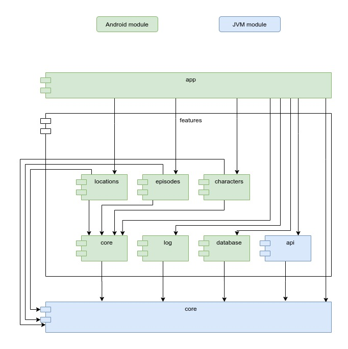

# android-example-project
A sample android project.

The application shows information about locations, characters and episodes of the animated series "Rick and Morty".
Implemented splash screen, swipe to refresh on lists and pagination.

It uses Open API from `https://rickandmortyapi.com/`.

### Installation
Open this project in Android Studio and click the `Run` button.

OR

Download the [APK file](RickAndMorty_1_0.apk) and install it on device.

### Architecture

#### `:app` module
An Android module. This is an entry point into app.
It contains splash screen, main activity & start fragment.
`:app` module configures DI and app navigation.

#### `:fetures:location`
An Android feature module. 
Contains all Location specific screens.

#### `:fetures:episodes`
An Android feature module. 
Contains all Episode specific screens.

#### `:fetures:charcters`
An Android feature module. 
Contains all Character specific screens.

#### `:fetures:core`
An Android module. 
Contains all common UI for feature modules.

#### `:fetures:log`
An Android module. 
Contains implementation of `Logger` interface from `:core` module with Android `Log` class.

#### `:features:database`
An Android module. 
Contains implementations of `Database` interface from `:core` module with Jetpack Room.

#### `:features:api`
A JVM module.
Contains implementations of `ApiProvider` interface from `:core` module with Retrofit.

#### `:core`
A JVM module.
Provides domain classes, interfaces for other modules and implementation of `Repository` interface.
